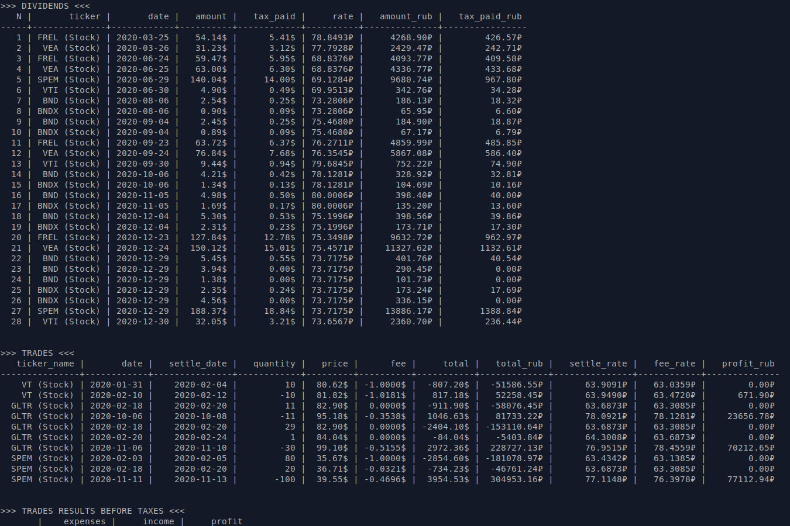

# Investments
Библиотека для анализа брокерских отчетов + утилиты для подготовки налоговой отчетности


## Установка/обновление
```
$ pip install investments --upgrade --user
```
или с помощью [poetry](https://python-poetry.org/)

## Утилита ibtax
Расчет прибыли Interactive Brokers для уплаты налогов для резидентов РФ

- расчет сделок по методу ФИФО, учет даты расчетов (settle date)
- конвертация по курсу ЦБ
- раздельный результат сделок по акциям и опционам + дивиденды
- учёт начисленных процентов на остаток по счету
- учитывает комисии по сделкам
- пока **НЕ** поддерживаются сделки в валютах, отличных от USD
- пока **НЕ** поддерживаются сплиты
- пока **НЕ** поддерживаются сделки Forex, сделка пропускается и выводится сообщение о том, что это может повлиять на итоговый отчет

*Пример отчета:*


### Запуск
Запустить `ibtax` указав в `--activity-reports-dir` и `--confirmation-reports-dir` директории отчетами в формате `.csv` (см. *Подготовка отчетов Interactive Brokers*)

Важно, чтобы csv-отчеты `activity` и `confirmation` были в разных директориях!


## Утилита ibdds
Утилита для подготовки отчёта о движении денежных средств по счетам у брокера Interactive Brokers (USA) для резидентов РФ

- выводит отчёт по каждой валюте счёта отдельно
- вывод максимально приближен к форме отчёта о ДДС

*Пример отчета:*


### Запуск
Запустить `ibdds` указав в `--activity-report-filepath` путь до отчёта о активности по счёту в формате `.csv` (см. *Подготовка отчетов Interactive Brokers*)

Важно: утилита не проверяет период отчёта `activity` и для корректной подготовки налоговой отчётности необходимо указать передать путь до отчёта за один год.


## Подготовка отчетов Interactive Brokers
Для работы нужно выгрузить из [личного кабинета](https://www.interactivebrokers.co.uk/sso/Login) два типа отчетов: *Activity statement* (сделки, дивиденды, информация по инструментам и т.п.) и *Trade Confirmation* (settlement date, необходимая для правильной конвертации сумм по курсу ЦБ)

### Activity statement
Для загрузки нужно перейти в **Reports / Tax Docs** > **Default Statements** > **Activity**

Выбрать `Format: CSV` и скачать данные за все доступное время (`Perioid: Annual` для прошлых лет + `Period: Year to Date` для текущего года)

**Обязательно выгрузите отчеты за все время существования вашего счета!**


### Trade Confirmation

Для загрузки нужно перейти в **Reports / Tax Docs** > **Flex Queries** > **Trade Confirmation Flex Query** и создать новый тип отчетов, выбрав в **Sections** > **Trade Confirmation** все пункты в группе **Executions**, остальные настройки - как на скриншоте:


После этого в **Reports / Tax Docs** > **Custom Statements** выгрузите отчеты **за все время существования вашего счета**, используя `Custom date range` периодами по 1 году (больше IB поставить не дает):


## Разворачивание проекта для внесения изменений

- Install [poetry](https://python-poetry.org/docs/#installation)
- Clone & modify & run

```
$ git clone https://github.com/cdump/investments

$ cd investments

$ poetry install
$ poetry run ibtax
usage: ibtax [-h] --activity-reports-dir ACTIVITY_REPORTS_DIR --confirmation-reports-dir CONFIRMATION_REPORTS_DIR [--cache-dir CACHE_DIR] [--years YEARS] [--verbose]
ibtax: error: the following arguments are required: --activity-reports-dir, --confirmation-reports-dir

$ vim investments/ibtax/ibtax.py # edit main file for example

$ poetry run ibtax # run updated version
```